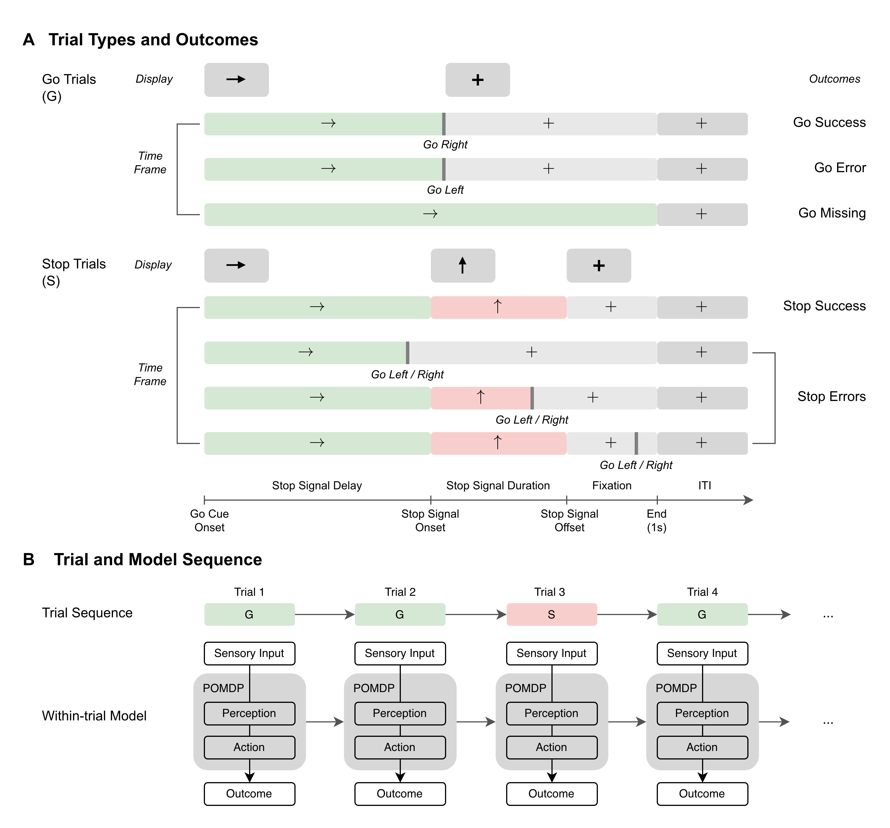

# Decomposing Response Inhibition: A POMDP Model

## Introduction

This repository contains the code for the research work [Decomposing response inhibition: a POMDP model](link here when published). It provides a comprehensive framework to formalize and parameterize the within-trial cognitive processes underlying the Stop Signal Task (SST), specifically tailored to the Adolescent Brain Cognitive Development (ABCD) study design.

The repository includes:
* **Data Processing:** Full pipelines for filtering, cleaning, and formatting behavioral data.
* **Computational Model:** The core Partially Observable Markov Decision Process (POMDP) cognitive model.
* **Model Fitting:** The inference pipeline Transformer-encoded Simulation-Based Inference (TeSBI).
* **Versatile Analysis:** Comprehensive scripts for parameter recovery, Posterior Predictive Checks (PPC), latent embeddings, statistical evaluation, and more.

Crucially, this project focuses on the relationship between computational phenotypes (i.e., inferred model parameters) and clinical traits (i.e., ADHD, sex, IQ and medication) within large-scale datasets of children (N > 5000).

This code is structured to allow for easy environment setup, local testing, and full High Performance Computing (HPC) deployment.

<p align="center">
  
</p>


## Quick Start

We provide an automated quick run test. It skips the raw data processing, uses the provided mock processed data, runs a model sanity check, performs a lightweight parameter inference, and tests all analysis scripts. It is designed to finish in a few minutes.

1. Clone the repository and enter the directory:
```bash
git clone git@github.com:wenting-wang/sst-pomdp.git
cd sst-pomdp
```

2. Create and activate the Conda environment:

You can set up your environment using either Conda or standard Python.

**Option A: Using Conda (Recommended)**

```bash
conda env create -f environment.yml
conda activate sst-pomdp-env
```

**Option B: Using standard Python (**`venv`**)**

If you do not have Conda installed, you can use Python's built-in virtual environment and `pip`:

```bash
python3 -m venv sst-pomdp-env
source sst-pomdp-env/bin/activate
pip install -r requirements.txt
```

3. Run the automated check:

```bash
python run_quick_check.py
```

If successful, the script will output `ALL TESTS PASSED SUCCESSFULLY!` and you can view the generated figures and tables in the `outputs/` folder.


## Detailed Guide

To reproduce the full pipeline used in the paper, follow these steps.

### Step 1: Data Cleaning (Optional)

If you have the raw datasets, you can run the quality control and filtering steps. Otherwise, you can skip this step and use the provided subject-level mock data in `data/example_*.csv`, and trial-level mock data in `data/example_processed_data/`.

```bash
# Optional: Run QC on raw data
python utils/01_qc_filter.py
python utils/02_qc_report.py
python utils/03_build_dataset.py
```

### Step 2: Model Sanity Check

Before fitting data, verify that the core POMDP model simulates dynamics of within-trial belief states, action values, and stop prior effects properly. This generates theoretical plots of the model's behavior.

```bash
# Generates the within-trial dynamics figures
python analysis/fig_dynamics.py
```

**Expected Output:** `fig_belief_states.png`, `fig_action_value.png`, and `fig_stop_prior_effects.png` plots saved in the `outputs/` folder.

```bash
# Generates the softmax policy figures
python analysis/fig_policy.py
```

**Expected Output:** `fig_policy_summary.png`, `fig_policy_GS.png`, `fig_policy_GE.png`, `fig_policy_GM.png`, `fig_policy_SS.png`, and `fig_policy_SE.png` plots saved in the `outputs/` folder.

### Step 3: Model Fitting

The main parameter inference pipeline uses a Transformer encoder and a SNPE neural network, which is quite computationally heavy for PCs. To reproduce the paper's full results, deploy the SLURM script on an HPC cluster with GPU access:

```bash
sbatch slurm/run_tesbi.sh
```

Note: To test a fast version of this locally, use the arguments provided inside `run_quick_check.py`.

The TeSBI pipeline operates in four stages:

1. **Pretrain** a Transformer encoder to learn patterns in sequential behavior.
2. **Train** a Sequential Neural Posterior Estimation (SNPE) network to learn the mapping between parameters and behavior.
3. **Parameter Recovery** to validate the inference method on simulated ground truth data.
4. **Parameter Inference** to extract the final subject-level parameters from observed trial-level behavior.

To further validate the inference methods alongside parameter recovery, you can extract the latent behavioral embeddings (using the pretrained encoder) and run posterior predictive checks (using the trained posterior):

```bash
# Extract latent behavioral embeddings
sbatch slurm/run_embedding.sh

# Run posterior predictive checks
sbatch slurm/run_ppc.sh
```

### Step 4: Results Analysis

Once the model is fit, or by using the pre-supplied example data in the `data/` folder, you can generate the figures and tables used in the manuscript. The analysis scripts are configured to read from the `data/` files so they work immediately out of the box.

```bash
# Generate the parameter distribution figure
python analysis/fig_param_dist.py

# Run linear models to show relationship between model parameters and clinical traits
python analysis/tab_lm_params.py

# Run posterior predictive checks (three representative subjects)
python analysis/fig_ppc_reps.py

# Run posterior predictive checks (all subjects)
python analysis/fig_ppc_population.py

# Run canonical correlation analysis (CCA)
python analysis/fig_cca.py

# Run PCA of latent behavioral embeddings analysis
python analysis/fig_pca_embed.py

# Generate parameter recovery analysis
python analysis/fig_params_recovery.py

# Run sensitivity analysis for marginal effect of parameters
python analysis/fig_sensitivity.py

# Generate demographics counts table (i.e., ADHD trait, sex, IQ, medication)
python analysis/tab_demo_counts.py

# Run linear models (behavior across demographics)
python analysis/tabl_lm_behavior.py

```

**Expected Output:** Final `.png` figures and `.tex` tables saved directly to the `outputs/` directory.


## Project Structure

The repository is divided into modular folders separating the core computational model, scalable inference on HPC, and downstream analysis.

* **`analysis/`**: Scripts to generate all paper figures and tables.

* **`core/`**: The fundamental computational and simulation modules.
  * `models.py`: The POMDP model.
  * `simulation.py`: Trial-level and task-level simulation.
  * `plotting.py`: Visualization of within-trial dynamics and policy.


* **`data/`**: Contains mock data in `example_processed_data/` and mock summary `.csv` files to allow users to test the analysis scripts without needing the raw, restricted clinical dataset.

* **`hpc/`**: Heavy computational pipelines for model fitting.
  * `tesbi.py`: The end-to-end TeSBI pipeline.
  * `embedding.py`: Extracts subject-level summary embeddings using the trained Transformer.
  * `ppc.py`: Posterior Predictive Checks (PPC).

* **`outputs/`**: Destination folders for generated plots, models, and tables.

* **`slurm/`**: Bash scripts (`run_tesbi.sh`, `run_ppc.sh`, etc.) for submitting `hpc/` tasks to an HPC cluster.
  
* **`utils/`**: Data processing, quality control, and system checks.
  * `01_qc_filter.py`, `02_qc_report.py`, `03_build_dataset.py`: Pipelines for filtering raw data and building analysis datasets.
  * `preprocessing.py`: Trial-level data cleaning and formatting.
  * `metrics.py`: Extract behavioral metrics.
  * `check_gpu.py`: Utility to verify CUDA/GPU availability.
* `environment.yml`: Environment setup file to install necessary dependencies.


## Reference

For full theoretical details, mathematical derivations, and comprehensive results, please refer to our paper: 

[citation/link here when published]


## Contact

If you have any concerns, have questions, or want to discuss the code, please feel free to open an issue on this repository or reach out directly:

Wenting Wang (wenting.wang@tuebingen.mpg.de)
